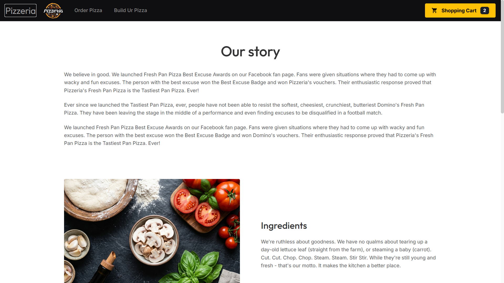
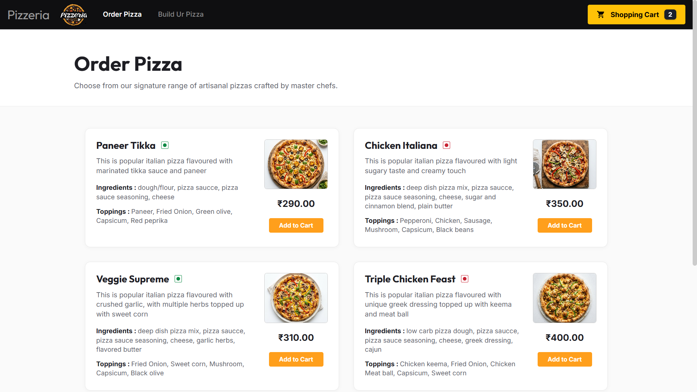
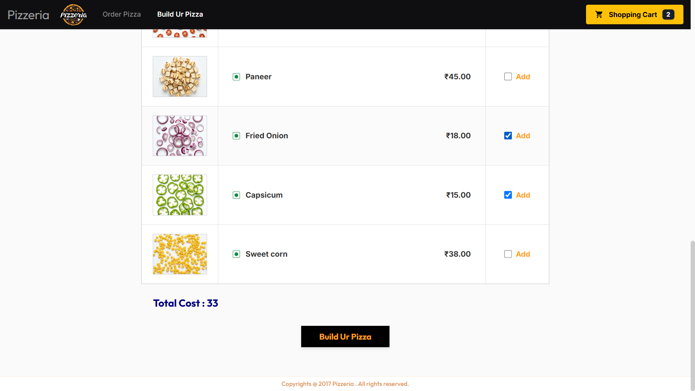
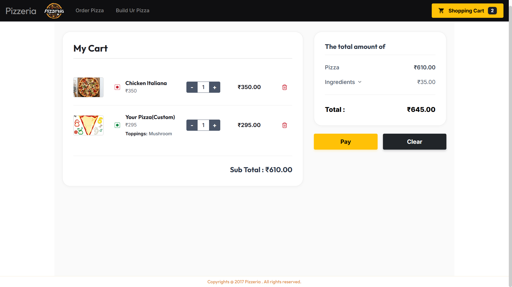

# Pizzeria - MEAN Stack Web Application

Pizzeria is a modern, responsive pizza ordering web application built using the
**MEAN stack** (MongoDB, Express.js, Angular, Node.js). It offers standard menu
choices, custom pizza builder options, cart management, and order placement.

---

## 🍕 Core Features

- **Artisanal Menu:** Browse signature vegetarian and non-vegetarian pizzas.
- **"Build Your Pizza" Customizer:** Select custom toppings (with live cost
  updates) to create custom pizzas.
- **Cart Management:** Add items, adjust quantities, delete items, view itemized
  price breakdowns (pizza bases vs. custom ingredients), and calculate totals.
- **Checkout & Order Storage:** Submit orders to the backend where they are
  verified and saved to MongoDB.

---

## 🛠️ Technology Stack & Architecture

### Directory Structure

```text
Pizzeria/
├── client/                # Angular Frontend Application
│   ├── src/app/
│   │   ├── core/          # Global interceptors, guards
│   │   ├── models/        # TypeScript models/interfaces
│   │   ├── services/      # Angular services (HTTP data fetching)
│   │   ├── shared/        # Common components (Header, Footer)
│   │   └── pages/         # Routed views (Home, Menu, Customizer, Cart)
│   └── proxy.conf.json    # Local development server API proxy
├── server/                # Node.js Express Backend API
│   ├── config/            # DB connection & Cloudinary configs
│   ├── controllers/       # HTTP Request/Response handlers
|   ├── middlewares/       # Global middleware 
│   ├── models/            # Mongoose MongoDB schemas
│   ├── routes/            # Express endpoint routing
│   ├── services/          # Business logic and DB queries
│   └── server.js          # App entry point
└── vercel.json            # Vercel monorepo deployment config
```

### Key Architectural Guidelines

- **Frontend (Angular):** Utilizes **Standalone Components**, Signal-based state
  management (`signal()`, `computed()`), and the modern functional `inject()`
  API. Directives like `*ngIf` and `*ngFor` are replaced by Angular's native
  `@if` and `@for` control flow blocks.
- **Backend (Express):** Adheres to a strict **Separation of Concerns** using a
  Controller-Service-Repository architecture. Controllers orchestrate HTTP
  requests while Services execute the database queries and business rules.
- **Database (MongoDB):** Utilizes **Mongoose ODM** with optimized queries using
  `.select()` for projections and `.lean()` for high-performance read-only
  queries.

---

## 🚀 Local Installation & Setup

### Prerequisites

- Node.js (v18 or higher recommended)

### 1. Backend Server Setup

1. Open a terminal and navigate to the server folder:
   ```bash
   cd server
   ```
2. Install dependencies:
   ```bash
   npm install
   ```
3. Create a `.env` file in the `server/` directory and configure the environment
   variables:
   ```env
   PORT=9000
   MONGODB_URI=your_mongodb_connection_string
   CLOUDINARY_CLOUD_NAME=your_cloudinary_name
   CLOUDINARY_API_KEY=your_cloudinary_key
   CLOUDINARY_API_SECRET=your_cloudinary_secret
   ```
4. Start the server in development mode:
   ```bash
   npm run dev
   ```
   The backend will run on `http://localhost:9000`.

---

### 2. Frontend Client Setup

1. Open a new terminal and navigate to the client folder:
   ```bash
   cd client
   ```
2. Install dependencies:
   ```bash
   npm install
   ```
3. Start the Angular development server:
   ```bash
   npm start
   ```
   The frontend will run on `http://localhost:4200` and automatically proxy API
   calls `/api/*` to the backend on `http://localhost:9000`.

---

## 🔌 API Documentation

All backend routes are prefixed with `/api` and return standardized JSON
responses:

### Pizzas Endpoint (`/api/pizzas`)

- **`GET /api/pizzas`**: Fetches all available pizzas.

### Toppings Endpoint (`/api/toppings`)

- **`GET /api/toppings`**: Fetches all custom toppings available for the pizza
  builder.

### Orders Endpoint (`/api/orders`)

- **`POST /api/orders`**: Submits a new customer order.
  - **Request Body Format:**
    ```json
    {
       "items": [
          {
             "pizza": {
                "name": "Custom Pizza",
                "isVeg": true,
                "price": 285.00,
                "ingredients": [],
                "toppings": ["Cheese", "Mushroom"],
                "image": "/custom pizza.webp"
             },
             "quantity": 1
          }
       ],
       "totalPrice": 285.00
    }
    ```

---

## ☁️ Vercel Deployment

This project is configured as a monorepo ready for deployment on **Vercel**:

1. **Vercel Routing (`vercel.json`):** A workspace-level config routes `/api/*`
   requests to the Express serverless function (`server/server.js`) and routes
   all other static assets/pages to the Angular build folder
   (`client/dist/client/browser`).
2. **Environment Variables:** During deployment on Vercel, navigate to Project
   Settings -> Environment Variables and add:
   - `MONGODB_URI`
   - `CLOUDINARY_CLOUD_NAME`
   - `CLOUDINARY_API_KEY`
   - `CLOUDINARY_API_SECRET`

---

## 📸 Application Screenshots

### 🏠 Home Page


### 🍕 Order Menu


### 🎨 Custom Pizza Builder (Customizer)


### 🛒 Shopping Cart

